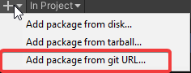
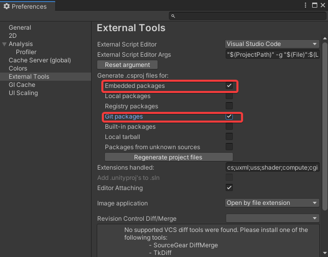

# Installation

## Production 

For production install as [git package](https://docs.unity3d.com/Manual/upm-ui-giturl.html) on master branch 



copy following url : `https://github.com/E-moko/<name of repo>.git`

## Local Development

In order to modify this package, you have to import it as an [embed package](https://docs.unity3d.com/Manual/CustomPackages.html#EmbedMe) 

**1) add a git submodule**

` git submodule add -b develop https://github.com/E-moko/<name of repo>.git Packages\<name of repo>`

**2) Delete all `.csproj` and `.sln` files in project's root**

**3) Click on `Open C# project in unity`**


## Dependencies Management

To solve decencies issues, add the following block to your `manifest.json`

```json
{
  "dependencies": {
  	...
  },
  "scopedRegistries": [
    {
      "name": "package.openupm.com",
      "url": "https://package.openupm.com",
      "scopes": [
        "com.dbrizov.naughtyattributes",
        "com.neuecc",
        "com.openupm",
        "com.svermeulen.extenject",
        "com.cysharp",
        "net.tnrd"
          <insert other needed dependencies>
      ]
    }
  ],
}
```


## Vs Code

For C# engine, apply following settings 

 

